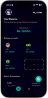
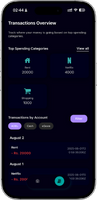

# 💸 Kharcha - Personal Finance Tracker

Kharcha is a sleek, modern personal finance tracking app built with **React Native**, **Expo**, and **Firebase**. It allows users to manage their income, expenses, and savings seamlessly — all stored locally with rich visualizations and recurring transaction support.

---

## 🚀 Features

- 📊 **Dashboard**: Visual overview of total balance, expenses, and income.
- 🧾 **Transactions**: Add, filter, edit, and delete expenses/income.
- 🗓️ **Recurring Transactions**: Automatically log daily, weekly, or monthly recurring entries.
- 🏦 **Multiple Accounts**: Track balances from cash, bank, eSewa, Khalti, etc.
- 🧠 **Native Design**: Built using `NativeWind` and custom modals for smooth UX.
- ☁️ **Firebase Integration**: Ready for email/password and Google authentication (in progress).
- 📅 **Date Filters**: Filter transactions by date or category.
- 📈 **Charts**: Dual line chart for monthly income vs expenses and category breakdowns.
- 🌙 **Dark/Light Mode**: Toggleable theme support.
- 🗂️ **Offline Local Storage**: Uses SQLite for fast and persistent data handling.

---

## 📦 Tech Stack

- ⚛️ React Native + Expo
- 🔥 Firebase v12 (Auth, Firestore, Storage)
- 🧠 SQLite via `expo-sqlite`
- 💨 NativeWind (Tailwind for React Native)
- ⏱ Luxon for date/time handling
- 📈 `react-native-gifted-charts` and `react-native-chart-kit`
- 🎨 Custom UI components and modals

---

## 🛠 Setup

### 1. Clone the repo

```bash
git clone https://github.com/itissulav/Kharcha.git
cd Kharcha
```

### 2. Install dependencies

```bash
npm install
```

### 3. Start the app

```bash
npm run start
```

You can run it on:

- Web: `npm run web`
- Android: `npm run android`
- iOS (Mac only): `npm run ios`

---

## 🔐 Firebase Setup

1. Go to [Firebase Console](https://console.firebase.google.com/) and create a project.
2. Add a Web App and copy the config keys.
3. Paste the keys inside `firebaseConfig.ts`:

```ts
const firebaseConfig = {
  apiKey: "...",
  authDomain: "...",
  projectId: "...",
  ...
};
```

4. Enable Email/Password and Google sign-in in **Authentication > Sign-in Methods**.

---

## 📁 Project Structure

```
├── app/
│   ├── (tabs)/         # Tab routes (Dashboard, Transactions, etc.)
│   ├── settings.tsx    # Settings screen
│   ├── profile.tsx     # Profile screen
│   ├── globals.css     # Tailwind styles
│   └── ...
├── components/         # All reusable modals & UI components
├── constants/          # Image & icon constants
├── db/                 # SQLite logic and helpers
├── utilities/          # Business logic functions
├── firebaseConfig.ts   # Firebase initialization
├── tailwind.config.js  # NativeWind config
├── nativewind-env.d.ts
├── tsconfig.json
└── ...
```

---

## 📸 Screenshots

| Dashboard                                                        | Transactions                                                          | Profile                                                       |
| ---------------------------------------------------------------- | --------------------------------------------------------------------- | ------------------------------------------------------------- |
|  |  |  |

---

## ✍️ Author

**Sulav Paudel**
GitHub: [@itissulav](https://github.com/itissulav)

---

## 📄 License

This project is licensed under the [MIT License](LICENSE).

---

## 💡 Future Plans

- ✅ User authentication
- ☁️ Firebase Cloud Sync
- 📦 Export/Import data
- 🔔 Expense alerts
- 🌐 Multi-language support
